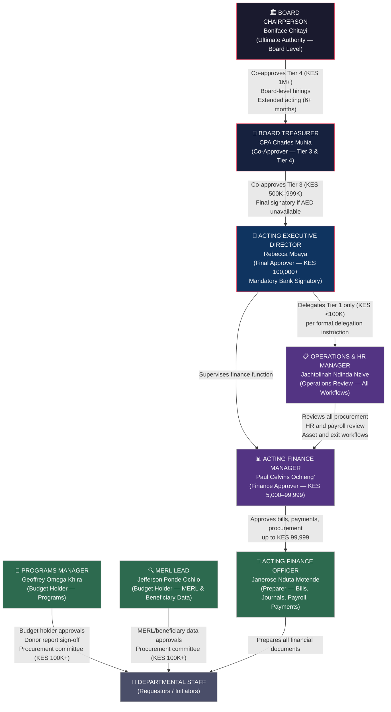
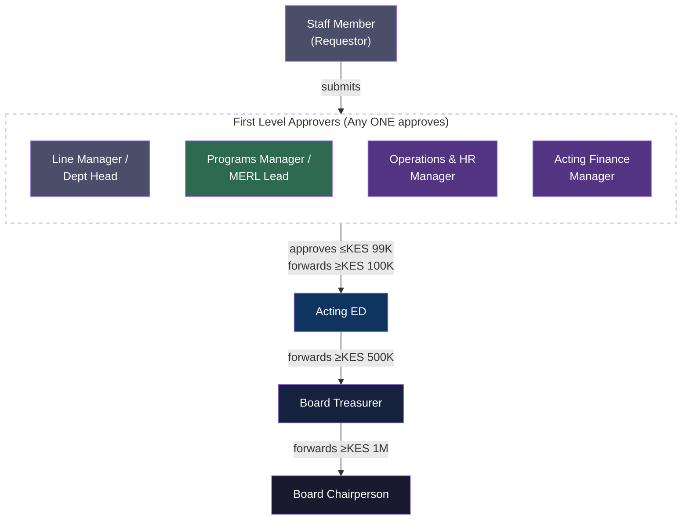

# OUTPUT 1 — GOVERNANCE HIERARCHY MAP
## BNBR Kenya | ApprovalMax Workflow Architecture

---

---

## APPROVAL TIER LEGEND

| Tier | Amount Range | Final Authority |
|------|-------------|-----------------|
| Tier 1 | KES 0 – 99,999 | Acting Finance Manager (Paul Ochieng') |
| Tier 2 | KES 100,000 – 500,000 | Acting ED (Rebecca Mbaya) |
| Tier 3 | KES 500,001 – 999,999 | Acting ED + Board Treasurer |
| Tier 4 | KES 1,000,000+ | Board Treasurer + Board Chairperson |

---

## ESCALATION CHAIN (Authority Override)

