# WORKFLOW 1 — PURCHASE REQUISITION & PROCUREMENT APPROVAL
## Source: Workflow Plan Extract — Section 5.1 / Tables 2, 3, 4

```mermaid
flowchart TD
    START([🟢 START: Procurement Need Identified]) --> REQ

    REQ["📝 REQUESTOR\nSubmit Purchase Requisition in ApprovalMax\nInclude: item description, quantity, estimated cost,\nbudget line, project code, required quotations\nAttach COI declaration\nAttach Data Sharing Agreement if vendor handles personal data"]

    REQ --> SYSCK1{"🤖 ApprovalMax AUTO-CHECK\n① Project code = active funded project?\n② Required quotations attached per tier?\n③ Single-sourcing justification if applicable?"}

    SYSCK1 -->|"❌ Incomplete"| REJ1(["🔴 RETURNED TO REQUESTOR\nResubmit with missing documents"])
    
    SYSCK1 -->|"✅ Passes"| SPLIT_CHK{"🛑 PROCUREMENT SPLIT CHECK\nApprovalMax flags if same supplier +\nsame project code + within 30 days\ncombined total crosses a threshold tier"}

    SPLIT_CHK -->|"🚨 Split detected"| FLAG1["⚠️ FLAGGED: Potential procurement splitting\nReferred to Operations & HR Manager\nfor written justification"]
    FLAG1 --> OHR_SPLIT{"Operations & HR Manager\nReviews split flag\nLegitimate or artificial split?"}
    OHR_SPLIT -->|"Artificial split confirmed"| HALT(["🔴 HALT: Procurement rejected\nPolicy breach recorded"])
    OHR_SPLIT -->|"Legitimate — justified in writing"| TIER_DET

    SPLIT_CHK -->|"✅ No split"| TIER_DET

    TIER_DET["💰 DETERMINE THRESHOLD & REQUIREMENTS\nTier 1: 0–4,999 (1 quote, single sourcing allowed)\nTier 2: 5,000–99,999 (3 quotes, Bid Analysis)\nTier 3: 100K–500K (3 quotes, LPO, 2-wk lead)\nTier 4: 500K–999K (3 quotes, LPO, 3-wk lead)\nTier 5: 1M+ (Full tender, Board award, 3-wk lead)"]

    TIER_DET --> DEPT_REV

    DEPT_REV["📋 STEP 2 — DEPARTMENT HEAD / PROGRAMS MGR / MERL LEAD\nGeoffrey Khira (Programs) / Jefferson Ponde (MERL) / Dept Head\n① Confirms programmatic need\n② Confirms budget availability (auto-checked vs Xero)\n③ Confirms procurement on annual plan OR\n   provides justification for unplanned procurement\nSLA: 24 hours"]

    DEPT_REV --> D1{"Dept Head Decision"}
    D1 -->|"❌ Return with comments"| REJ2(["🟡 RETURNED TO REQUESTOR\nCorrects and resubmits"])
    D1 -->|"✅ Approved"| OHR_REV

    OHR_REV["🏢 STEP 3 — OPERATIONS & HR MANAGER\nJachtolinah Ndinda Nzive\n① Correct quotation count for tier?\n② Prequalified suppliers used?\n③ Bid Analysis Form completed?\n④ COI declaration signed?\n⑤ Single-sourcing justification if applicable?\nSLA: 24 hours"]

    OHR_REV --> D2{"Ops & HR Mgr Decision"}
    D2 -->|"❌ Return"| REJ3(["🟡 RETURNED TO REQUESTOR\nComments attached"])
    D2 -->|"✅ Approved"| FIN_REV

    FIN_REV["💼 STEP 4 — ACTING FINANCE MANAGER\nPaul Celvins Ochieng'\n① Budget coding correct?\n② Donor eligibility confirmed?\n③ VAT / WHT treatment verified?\n④ Supplier legitimacy confirmed?\n⑤ Payment only to entity on approved LPO?\n⑥ Data Sharing Agreement in place\n   where vendor handles personal data?\nSLA: 24 hours"]

    FIN_REV --> D3{"Finance Mgr Decision"}
    D3 -->|"❌ Query"| REJ4(["🟡 RETURNED TO FO\nActing FO resolves query"])
    D3 -->|"✅ Approved"| LPO_GEN

    LPO_GEN["🖨️ LPO GENERATED IN XERO\n(For procurements KES 5,000 and above)\nPayment entity locked to LPO entity"]

    LPO_GEN --> TIER_GATE{"TIER APPROVAL GATE\nWhat tier is this procurement?"}

    TIER_GATE -->|"Tier 1 or Tier 2\n(KES 0–99,999)"| APPROVED_T1T2["✅ APPROVED — Tier 1 / Tier 2\nFinal authority: Acting Finance Manager\n(Paul Ochieng')"]

    TIER_GATE -->|"Tier 3\n(KES 100,000–500,000)"| AED_APPR["🔑 STEP 5a — ACTING EXECUTIVE DIRECTOR\nRebecca Mbaya\nApproves via ApprovalMax mobile or web\nSLA: 48–72 hours"]
    AED_APPR --> D4a{"AED Decision"}
    D4a -->|"❌ Reject"| REJ5a(["🔴 REJECTED\nFull explanation required"])
    D4a -->|"✅ Approved"| APPROVED_T3["✅ APPROVED — Tier 3\nFinal authority: Acting ED"]

    TIER_GATE -->|"Tier 4\n(KES 500,001–999,999)"| AED_BT["🔑 STEP 5b — ACTING ED + BOARD TREASURER\nRebecca Mbaya + CPA Charles Muhia\nBoth approvals MANDATORY\nSLA: 48–72 hours"]
    AED_BT --> D4b{"Both approved?"}
    D4b -->|"❌ Either rejects"| REJ5b(["🔴 REJECTED\nExplanation required"])
    D4b -->|"✅ Both approved"| APPROVED_T4["✅ APPROVED — Tier 4\nFinal authority: AED + Board Treasurer"]

    TIER_GATE -->|"Tier 5\n(KES 1,000,000+)"| BOARD_FULL["🏛️ STEP 5c — FULL BOARD APPROVAL\nBoard Treasurer (CPA Charles Muhia)\n+ Board Chairperson (Boniface Chitayi)\nFull tendering process\nBoard award decision\nSLA: Up to 3 weeks"]
    BOARD_FULL --> D4c{"Board Decision"}
    D4c -->|"❌ Rejected"| REJ5c(["🔴 REJECTED\nBoard resolution documented"])
    D4c -->|"✅ Approved"| APPROVED_T5["✅ APPROVED — Tier 5\nFinal authority: Board Treasurer + Board Chairperson"]

    APPROVED_T1T2 --> GRN_STEP
    APPROVED_T3 --> GRN_STEP
    APPROVED_T4 --> GRN_STEP
    APPROVED_T5 --> GRN_STEP

    GRN_STEP["📦 GOODS / SERVICES RECEIVED\nUser department verifies against LPO / Contract\nSigns Goods Received Note (GRN)\nWithin 1 working day of receipt\nGRN passed to Finance within 1 working day"]

    GRN_STEP --> GRN_UP["🤖 SYSTEM ACTION (ApprovalMax/Xero)\nGRN uploaded and linked to Xero PO\nBill Matching Workflow (Section 5.2) TRIGGERED"]

    GRN_UP --> END_OK(["🟢 END: Procurement Complete\nAudit trail locked in ApprovalMax"])

    style START fill:#2d6a4f,color:#fff
    style END_OK fill:#2d6a4f,color:#fff
    style HALT fill:#c1121f,color:#fff
    style REJ1 fill:#e07a5f,color:#fff
    style REJ2 fill:#e07a5f,color:#fff
    style REJ3 fill:#e07a5f,color:#fff
    style REJ4 fill:#e07a5f,color:#fff
    style REJ5a fill:#c1121f,color:#fff
    style REJ5b fill:#c1121f,color:#fff
    style REJ5c fill:#c1121f,color:#fff
    style APPROVED_T1T2 fill:#2d6a4f,color:#fff
    style APPROVED_T3 fill:#2d6a4f,color:#fff
    style APPROVED_T4 fill:#2d6a4f,color:#fff
    style APPROVED_T5 fill:#2d6a4f,color:#fff
    style FLAG1 fill:#f4a261,color:#000
    style TIER_DET fill:#264653,color:#fff
    style BOARD_FULL fill:#1a1a2e,color:#fff
```

---

## PROCUREMENT POLICY KEY CONTROLS (Source: Table 4)

| Control | Rule |
|---------|------|
| No Procurement Splitting | ApprovalMax flags: same supplier + same project code + within 30 days where combined total crosses a threshold tier |
| Single Sourcing | Restricted to KES 4,999.99 or below; OR exclusive supplier / warranty / donor-imposed. Written justification from Ops & HR Mgr + Acting ED written approval required |
| Conflict of Interest | All staff sign COI declaration stored in ApprovalMax vendor record. No participation where personal relationship with supplier exists |
| Data Protection | Vendor contracts involving personal data processing require Data Sharing Agreement (Data Protection Policy Section 10.1.3) |
| Bid Analysis Form | Mandatory for ALL procurement. Must detail evaluation criteria and rationale. Uploaded before procurement can proceed |
