# 04a: WF01a — Standalone Purchase Requisition

This workflow handles the internal request, department head approval, sourcing, and compliance checks. It operates as a Custom Standalone Workflow in ApprovalMax to allow for custom text fields.

```mermaid
flowchart TD
    START([🟢 START: Procurement Need Identified]) --> REQ

    REQ["📝 STEP 1 — REQUESTOR (Standalone Form)\nSubmit Standalone Purchase Requisition\nCustom Fields: Project name, Activity, Budget line, Date needed,\nItem description, Qty, Size/Colour, Extra specific details"]

    REQ --> SYSCK1{"🤖 ApprovalMax AUTO-CHECK\n① Project code = active funded project?\n② Budget code exists?"}

    SYSCK1 -->|"❌ Incomplete"| REJ_SYS(["🔴 RETURNED TO REQUESTOR\nSystem Blocked"])
    
    SYSCK1 -->|"✅ Passes"| DEPT_REV

    DEPT_REV["📋 STEP 2 — DEPARTMENT HEAD REVIEW\n(Routed via Tracking Category Matrix)\n① Confirms programmatic need\n② Confirms budget availability\n③ Confirms procurement on annual plan\nSLA: 24 hours"]
    
    DEPT_REV --> D1{"Dept Head Decision"}
    D1 -->|"❌ Return with comments"| REJ1(["🔴 RETURNED TO REQUESTOR\nCorrects and resubmits"])
    D1 -->|"✅ Approved"| PO_SOURCING

    PO_SOURCING["🛒 STEP 3 — PROCUREMENT SOURCING\n(Eleanor Ushindi)\n① Sources from prequalified list\n② For KES 5,000+: Obtains min. 3 quotes\n③ Uploads Bid Analysis Form to request\n④ Gathers Single-Source justification if applicable"]

    PO_SOURCING --> PO_SPLIT{"🛑 PO SPLIT CHECK\nProcurement manually verifies if same supplier +\nsame project code + within 30 days\ncrosses a threshold tier."}

    PO_SPLIT -->|"🚨 Split detected"| SPLIT_RES["⚠️ SPLIT RESOLUTION\nDocuments requirement to raise\nmultiple distinct POs for separate routing"]
    
    PO_SPLIT -->|"✅ No split"| FO_REV
    SPLIT_RES --> FO_REV

    FO_REV["💼 STEP 4 — FINANCE OFFICER REVIEW\n① Reviews Bid Analysis for mathematical accuracy\n② Verifies compliance with prequalified vendor list\nSLA: 24 hours"]

    FO_REV --> D2{"FO Decision"}
    D2 -->|"❌ Query"| REJ2(["🟡 RETURNED TO PROCUREMENT\nResolves query"])
    D2 -->|"✅ Reviewed"| OHR_REV

    OHR_REV["🏢 STEP 5 — OPERATIONS & HR MANAGER REVIEW\n① Correct quotation count for tier?\n② Prequalified suppliers used?\n③ Bid Analysis Form completed & uploaded?\nSLA: 24 hours"]

    OHR_REV --> D3{"Ops & HR Mgr Decision"}
    D3 -->|"❌ Query"| REJ3(["🟡 RETURNED TO PROCUREMENT\nComments attached"])
    D3 -->|"✅ Reviewed"| FM_APPR

    FM_APPR["📊 STEP 6 — FINANCE MANAGER APPROVAL\n① Final sign-off on the Sourcing process\n② Verifies donor eligibility and VAT treatment\nSLA: 24 hours"]

    FM_APPR --> D4{"Finance Mgr Decision"}
    D4 -->|"❌ Query"| REJ4(["🟡 RETURNED TO PROCUREMENT\nResolves query"])
    D4 -->|"✅ Approved"| END_SOURCING(["🟢 END WF01a: Standalone Requisition Approved.\nPDF generated. Proceed to LPO Generation."])

    style START fill:#2d6a4f,color:#fff
    style END_SOURCING fill:#2d6a4f,color:#fff
    style REJ_SYS fill:#e07a5f,color:#fff
    style REJ1 fill:#e07a5f,color:#fff
    style REJ2 fill:#e07a5f,color:#fff
    style REJ3 fill:#e07a5f,color:#fff
    style REJ4 fill:#e07a5f,color:#fff
    style PO_SOURCING fill:#264653,color:#fff
    style SPLIT_RES fill:#f4a261,color:#000
```

