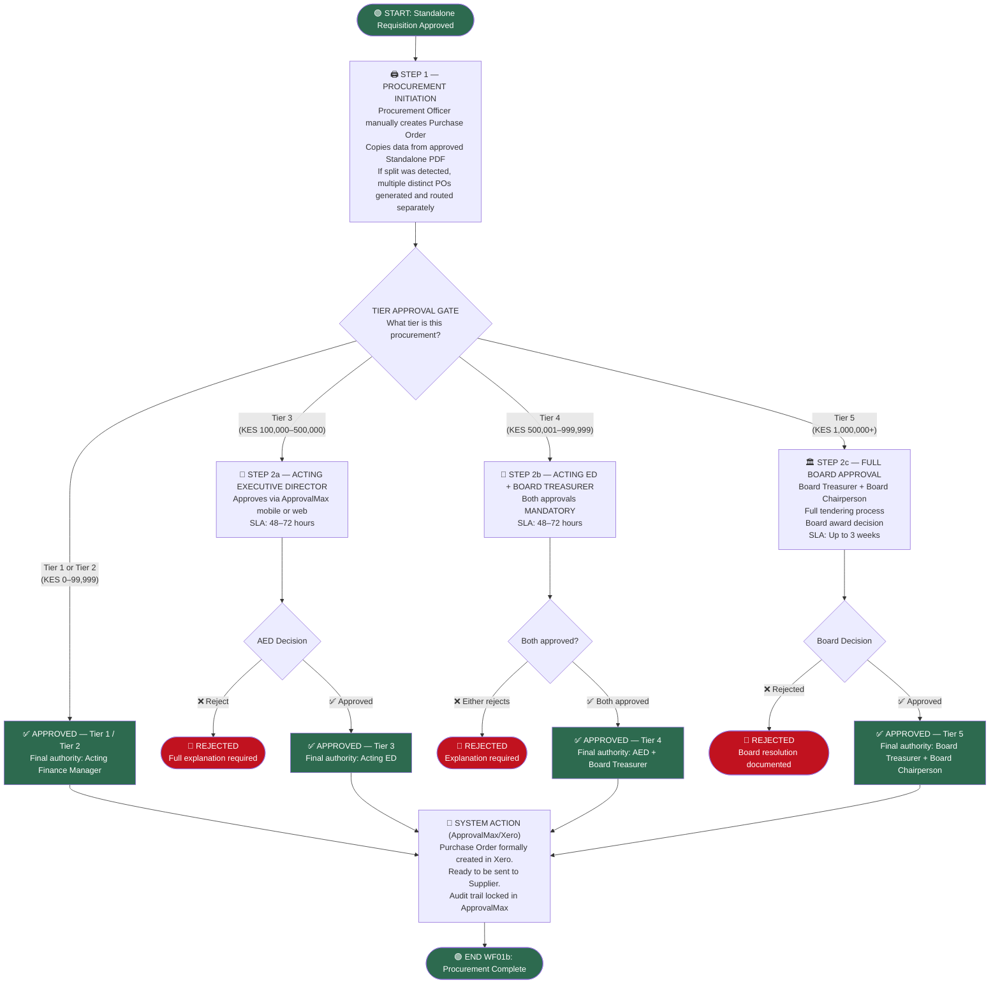

# 04b: WF01b — Purchase Order Generation

This workflow handles the final generation of the LPO in Xero and the Tier Gates. It operates as a Xero-linked Purchase Order Workflow in ApprovalMax, manually initiated by the Procurement Officer after the Standalone Requisition (WF01a) is complete.

