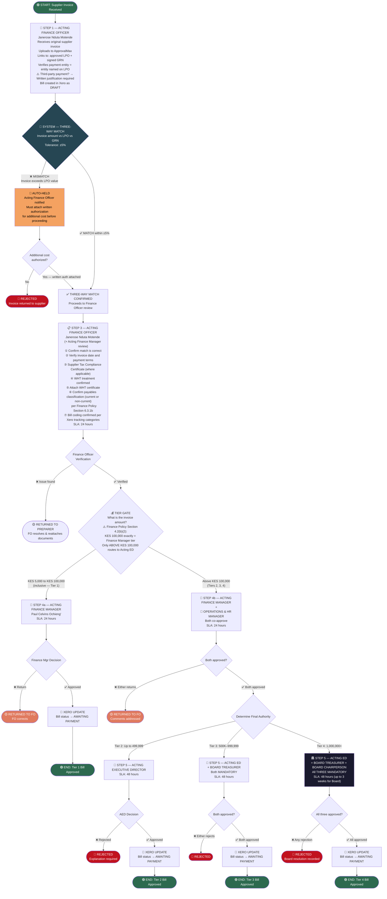

# WORKFLOW 2 — SUPPLIER BILL (INVOICE) APPROVAL
## Source: Workflow Plan Extract — Section 5.2 / Table 5

```mermaid
flowchart TD
    START([🟢 START: Supplier Invoice Received]) --> UPLOAD

    UPLOAD["📄 STEP 1 — ACTING FINANCE OFFICER\nJanerose Nduta Motende\nReceives original supplier invoice\nUploads to ApprovalMax\nLinks to: approved LPO + signed GRN\nVerifies payment entity = entity named on LPO\n⚠️ Third-party payment? → Written justification required\nBill created in Xero as DRAFT"]

    UPLOAD --> MATCH3{"🤖 SYSTEM — THREE-WAY MATCH\nInvoice amount vs LPO vs GRN\nTolerance: ±5%"}

    MATCH3 -->|"❌ MISMATCH\nInvoice exceeds LPO value"| HOLD["🔴 AUTO-HELD\nActing Finance Officer notified\nMust attach written authorization\nfor additional cost before proceeding"]
    HOLD --> AUTH_ADD{"Additional cost\nauthorized?"}
    AUTH_ADD -->|"No"| REJECT_INV(["🔴 REJECTED\nInvoice returned to supplier"])
    AUTH_ADD -->|"Yes — written auth attached"| MATCH3_OK

    MATCH3 -->|"✅ MATCH within ±5%"| MATCH3_OK

    MATCH3_OK["✅ THREE-WAY MATCH CONFIRMED\nProceeds to Finance Officer review"]

    MATCH3_OK --> FO_REV["📋 STEP 3 — ACTING FINANCE OFFICER\nJanerose Nduta Motende (+ Acting Finance Manager review)\n① Confirm match is correct\n② Verify invoice date and payment terms\n③ Supplier Tax Compliance Certificate (where applicable)\n④ WHT treatment confirmed\n⑤ Attach WHT certificate\n⑥ Confirm payables classification (current or non-current)\n   per Finance Policy Section 6.3.1b\n⑦ Bill coding confirmed per Xero tracking categories\nSLA: 24 hours"]

    FO_REV --> D1{"Finance Officer\nVerification"}
    D1 -->|"❌ Issue found"| RESOLVE(["🟡 RETURNED TO PREPARER\nFO resolves & reattaches documents"])
    D1 -->|"✅ Verified"| TIER_GATE

    TIER_GATE{"💰 TIER GATE\nWhat is the invoice amount?\n⚠️ Finance Policy Section 4.2(b)(2):\nKES 100,000 exactly = Finance Manager tier\nOnly ABOVE KES 100,000 routes to Acting ED"}

    TIER_GATE -->|"KES 5,000 to KES 100,000\n(inclusive — Tier 1)"| FM_APPR["💼 STEP 4a — ACTING FINANCE MANAGER\nPaul Celvins Ochieng'\nSLA: 24 hours"]
    FM_APPR --> D2a{"Finance Mgr Decision"}
    D2a -->|"❌ Return"| REJ_T1(["🟡 RETURNED TO FO\nFO corrects"])
    D2a -->|"✅ Approved"| XERO_T1["🤖 XERO UPDATE\nBill status → AWAITING PAYMENT"]
    XERO_T1 --> END_OK1(["🟢 END: Tier 1 Bill Approved"])

    TIER_GATE -->|"Above KES 100,000\n(Tiers 2, 3, 4)"| FM_OHR["💼 STEP 4b — ACTING FINANCE MANAGER\n+\n🏢 OPERATIONS & HR MANAGER\nBoth co-approve\nSLA: 24 hours"]
    FM_OHR --> D2b{"Both approved?"}
    D2b -->|"❌ Either returns"| REJ_T2(["🟡 RETURNED TO FO\nComments addressed"])
    D2b -->|"✅ Both approved"| FINAL_TIER{"Determine Final Authority"}

    FINAL_TIER -->|"Tier 2: Up to 499,999"| AED_T2["🔑 STEP 5 — ACTING EXECUTIVE DIRECTOR\nSLA: 48 hours"]
    AED_T2 --> D3a{"AED Decision"}
    D3a -->|"❌ Rejected"| REJ_T2b(["🔴 REJECTED\nExplanation required"])
    D3a -->|"✅ Approved"| XERO_T2["🤖 XERO UPDATE\nBill status → AWAITING PAYMENT"]
    XERO_T2 --> END_OK2(["🟢 END: Tier 2 Bill Approved"])

    FINAL_TIER -->|"Tier 3: 500K–999,999"| AED_BT["🔑 STEP 5 — ACTING ED + BOARD TREASURER\nBoth MANDATORY\nSLA: 48 hours"]
    AED_BT --> D3b{"Both approved?"}
    D3b -->|"❌ Either rejects"| REJ_T3(["🔴 REJECTED"])
    D3b -->|"✅ Both approved"| XERO_T3["🤖 XERO UPDATE\nBill status → AWAITING PAYMENT"]
    XERO_T3 --> END_OK3(["🟢 END: Tier 3 Bill Approved"])

    FINAL_TIER -->|"Tier 4: 1,000,000+"| BOARD_ALL["🏛️ STEP 5 — ACTING ED + BOARD TREASURER + BOARD CHAIRPERSON\nAll THREE MANDATORY\nSLA: 48 hours (up to 3 weeks for Board)"]
    BOARD_ALL --> D3c{"All three approved?"}
    D3c -->|"❌ Any rejection"| REJ_T4(["🔴 REJECTED\nBoard resolution recorded"])
    D3c -->|"✅ All approved"| XERO_T4["🤖 XERO UPDATE\nBill status → AWAITING PAYMENT"]
    XERO_T4 --> END_OK4(["🟢 END: Tier 4 Bill Approved"])

    style START fill:#2d6a4f,color:#fff
    style END_OK1 fill:#2d6a4f,color:#fff
    style END_OK2 fill:#2d6a4f,color:#fff
    style END_OK3 fill:#2d6a4f,color:#fff
    style END_OK4 fill:#2d6a4f,color:#fff
    style REJECT_INV fill:#c1121f,color:#fff
    style REJ_T1 fill:#e07a5f,color:#fff
    style REJ_T2 fill:#e07a5f,color:#fff
    style REJ_T2b fill:#c1121f,color:#fff
    style REJ_T3 fill:#c1121f,color:#fff
    style REJ_T4 fill:#c1121f,color:#fff
    style HOLD fill:#f4a261,color:#000
    style BOARD_ALL fill:#1a1a2e,color:#fff
    style MATCH3 fill:#264653,color:#fff
```
