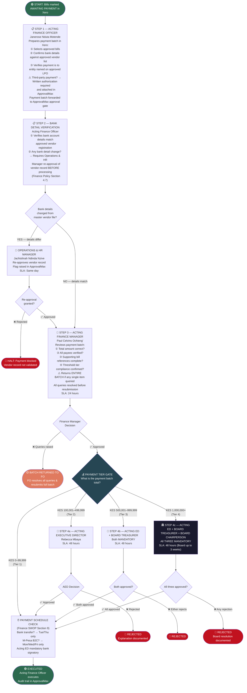
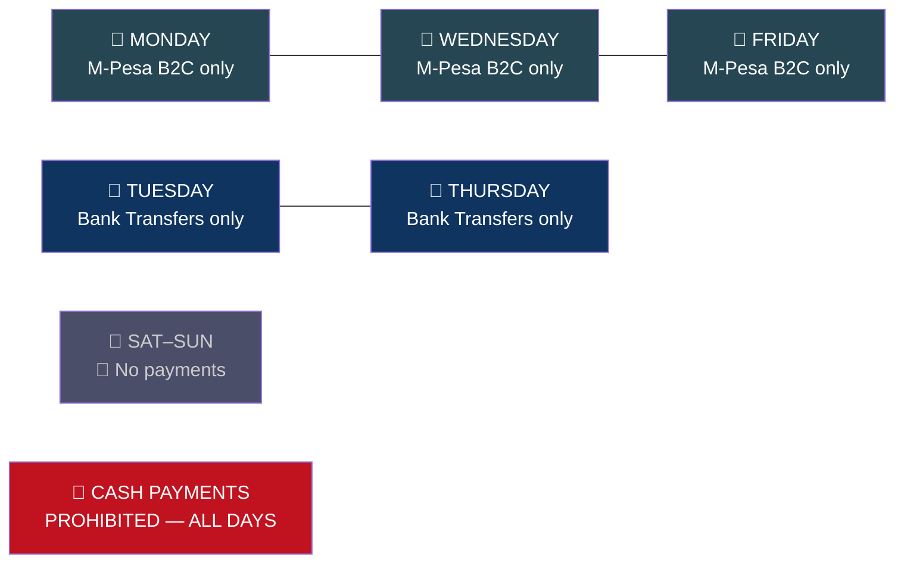

# WORKFLOW 3 — PAYMENT APPROVAL & EXECUTION
## Source: Workflow Plan Extract — Section 5.3 / Tables 6, 7

---

## FIXED PAYMENT SCHEDULE (Finance SWOP Section 9)

> **Activity participant payments:** Same day or next day after activity. Documentation to Finance by 3pm on activity day.
> **Per diem advances:** 1 working day before travel. Accountability due within 5 working days of return.
> **ApprovalMax payment reference** must appear on ALL bank transfer instructions.
> **Acting ED (Rebecca Mbaya)** is the MANDATORY bank signatory on all bank transfers.
