# WORKFLOW 4 — CASH REQUISITION, IMPREST & PETTY CASH
## Source: Workflow Plan Extract — Section 5.4 / Table 8

```mermaid
flowchart TD
    START([🟢 START: Cash / Imprest Need Identified]) --> TYPE{"Type of\nRequest?"}

    TYPE -->|"Field Imprest / Per Diem"| FIELD_REQ
    TYPE -->|"Petty Cash Replenishment\n(Float at 75% utilisation)"| PETTY_REQ

    FIELD_REQ["📝 STEP 1 — FIELD STAFF / PROGRAMME ASSISTANT\nSubmit Cash / Imprest Requisition in ApprovalMax\nInclude:\n① Purpose\n② Amount\n③ Activity\n④ Project code\n⑤ Expected retirement date"]

    PETTY_REQ["📝 STEP 1 — PETTY CASH CUSTODIAN\n(Operations & HR Department)\nSubmit expense log with:\n① All vouchers\n② All receipts\nWhen float reaches 75% utilisation\n(Nairobi: KES 40,000 float / KES 5,000 max single\nKilifi/Bungoma: KES 10,000 float / KES 2,500 max single)"]

    FIELD_REQ --> ADV_CHK{"🤖 SYSTEM CHECK\nDoes staff member have\nan UNRETIRED advance?"}
    ADV_CHK -->|"YES — outstanding advance exists"| BLOCK(["🔴 BLOCKED\nNew request blocked\nStaff must retire existing advance first"])

    ADV_CHK -->|"NO — no outstanding advance"| LINE_MGR_REV

    PETTY_REQ --> LINE_MGR_REV

    LINE_MGR_REV["📋 STEP 2 — LINE MANAGER (MERL LEAD / PROGRAMS MANAGER / OPS & HR MANAGER)\nJefferson Ponde (MERL) / Geoffrey Khira (Programs) / Jachtolinah Nzive (Ops)\n① Confirms programmatic need\n② Confirms budget availability\n③ Checks outstanding unretired imprest\nSLA: 24 hours"]

    LINE_MGR_REV --> D1{"Line Manager\nDecision"}
    D1 -->|"❌ Return"| REJ1(["🟡 RETURNED TO REQUESTOR\nRequestor corrects and resubmits"])
    D1 -->|"✅ Approved"| FO_CHECK

    FO_CHECK["💼 STEP 3 — ACTING FINANCE OFFICER + ACTING FINANCE MANAGER\nJanerose Nduta Motende / Paul Celvins Ochieng'\nField: Checks budget, verifies documentation, confirms no outstanding advances\nPetty Cash: Reviews ALL expense log vouchers and receipts\nSLA: 24 hours"]

    FO_CHECK --> D2{"Finance Check\nResult"}
    D2 -->|"❌ Documentation incomplete"| REJ2(["🟡 RETURNED TO REQUESTOR\nDocumentation corrected"])
    D2 -->|"✅ Approved"| AMOUNT_GATE

    AMOUNT_GATE{"💰 Is imprest amount\nABOVE KES 20,000?"}

    AMOUNT_GATE -->|"YES — above KES 20,000"| OHR_SO["🏢 STEP 4 — OPERATIONS & HR MANAGER SIGN-OFF\nJachtolinah Ndinda Nzive\nSign-off required for imprest above KES 20,000\nSLA: Same day"]
    OHR_SO --> D3{"Ops & HR Mgr\nSign-off?"}
    D3 -->|"❌ Declined"| REJ3(["🔴 RETURNED TO REQUESTOR\nJustification required"])
    D3 -->|"✅ Signed off"| PAY_RELEASE

    AMOUNT_GATE -->|"NO — KES 20,000 or below"| PAY_RELEASE

    PAY_RELEASE["💳 PAYMENT RELEASED\nVia M-Pesa or bank transfer ONLY\nPer Finance SWOP payment schedule\n(Bank: Tues/Thurs | M-Pesa: Mon/Wed/Fri)\n🚫 Cash disbursements PROHIBITED\nAdvance recorded as manual journal in Xero\nAudit trail in ApprovalMax"]

    PAY_RELEASE --> RETIRE_TRACK["⏰ RETIREMENT CLOCK STARTS\nApprovalMax triggers reminder at Day 3\nRetirement deadlines:\n• Per diems → 5 working days after return\n• In-county field activities → 7 working days\n• Travel → 14 working days"]

    RETIRE_TRACK --> RETIRE{"Staff Retires\nAdvance?"}

    RETIRE -->|"YES — on time\nReceipts + accountability\nform uploaded"| FO_RETIRE["Acting Finance Officer\nReviews and approves retirement\nXero manual journal reversed/cleared"]
    FO_RETIRE --> END_OK(["🟢 END: Advance Retired\nAudit trail complete"])

    RETIRE -->|"NO / LATE"| LATE_FLAG(["⚠️ LATE ACCOUNTABILITY\nSurcharge applied\nPay withheld pending accountability"])

    style START fill:#2d6a4f,color:#fff
    style END_OK fill:#2d6a4f,color:#fff
    style BLOCK fill:#c1121f,color:#fff
    style REJ1 fill:#e07a5f,color:#fff
    style REJ2 fill:#e07a5f,color:#fff
    style REJ3 fill:#c1121f,color:#fff
    style LATE_FLAG fill:#f4a261,color:#000
    style PAY_RELEASE fill:#264653,color:#fff
```

---

## PETTY CASH FLOAT CONTROLS

| Office | Float Limit | Max Single Payment | Replenishment Trigger |
|--------|------------|-------------------|----------------------|
| Nairobi | KES 40,000 | KES 5,000 | 75% utilisation (KES 30,000 spent) |
| Kilifi | KES 10,000 | KES 2,500 | 75% utilisation (KES 7,500 spent) |
| Bungoma | KES 10,000 | KES 2,500 | 75% utilisation (KES 7,500 spent) |

> **Custodian:** Operations & HR Department for all offices.
> **Cash disbursements:** PROHIBITED. All payments via M-Pesa or bank transfer.
