# WORKFLOW 5 — PAYROLL APPROVAL
## Source: Workflow Plan Extract — Section 5.5 / Table 9

```mermaid
flowchart TD
    START([🟢 START: Monthly Payroll Cycle\nBy 20th of each month]) --> PREP

    PREP["📊 STEP 1 — OPERATIONS & HR MANAGER\nJachtolinah Ndinda Nzive\nPrepares monthly payroll summary\nExports payroll journal for Xero import\nIncorporates approved changes:\n• Acting allowances (HR Policy Section 3.4)\n• Leave without pay deductions (HR Policy Section 5.5)\n• SRBS contributions (HR Policy Section 7)\n⚠️ All payroll data = Sensitive Personal Data\n   (Data Protection Policy Section 6.6)\n   Access restricted: HR, Finance, Acting ED ONLY\nPayroll journal uploaded to ApprovalMax as DRAFT\nDeadline: By 20th of each month"]

    PREP --> COLA_CHK{"Is this\nJanuary payroll?\n(Annual COLA\nadjustment)"}

    COLA_CHK -->|"YES — January COLA"| COLA_APPR["🔑 ADDITIONAL STEP — ANNUAL COLA\nRequires CO-APPROVAL:\n① Acting ED (Rebecca Mbaya)\n② Board Treasurer (CPA Charles Muhia)\nBefore payroll proceeds\n(HR Policy Section 3.8)"]
    COLA_APPR --> D_COLA{"COLA co-approved?"}
    D_COLA -->|"❌ Not approved"| HOLD_COLA["🔴 Payroll HELD\nPayroll with previous rates until\nCOLA is formally approved"]
    D_COLA -->|"✅ Both approved"| FM_REVIEW

    COLA_CHK -->|"NO"| FM_REVIEW

    FM_REVIEW["💼 STEP 2 — ACTING FINANCE MANAGER + ACTING FINANCE OFFICER\nPaul Celvins Ochieng' / Janerose Nduta Motende\n① Verify each employee record vs signed contract\n② Check pay increment letters applied\n③ Acting allowance authorizations confirmed\n④ Current statutory deductions per applicable legislation\n⑤ Voluntary deductions correct\n⑥ Bank account details verified\n⑦ Flag any variance\nDeadline: By 22nd of each month"]

    FM_REVIEW --> D1{"Finance Review\nResult"}
    D1 -->|"❌ Variance found"| FLAG_VAR(["🟡 RETURNED TO HR\nOperations & HR Manager notified to correct & resubmit"])
    D1 -->|"✅ No variance"| OHR_APPR

    OHR_APPR["🏢 STEP 3 — OPERATIONS & HR MANAGER\nJachtolinah Ndinda Nzive\nApproves payroll confirming:\n① New appointments correctly reflected\n② Terminations correctly reflected\n③ Leave without pay correctly deducted\nNote: Staff appointments per management-approved\npositions (management hires) or Board-approved\nhirings (Board-level positions)\nDeadline: By 23rd of each month"]

    OHR_APPR --> D2{"Ops & HR Mgr\nDecision"}
    D2 -->|"❌ Return"| REJ_HR(["🟡 RETURNED TO PREPARER\nCorrections required"])
    D2 -->|"✅ Approved"| XERO_POST["🤖 SYSTEM ACTION\nApproval in ApprovalMax\nPayroll journal posted to Xero"]

    XERO_POST --> SEG_CHK{"🤖 AUTOMATED SEGREGATION RULE\n(Finance Policy Section 2.2.3(a))\nApprovalMax checks:\nIs Preparer = Acting ED (Rebecca Mbaya)?"}

    SEG_CHK -->|"YES — Preparer = Acting ED\nSelf-approval prohibited"| BT_ROUTE["🔄 AUTOMATED REROUTE to BOARD TREASURER\nCPA Charles Muhia\nApprovalMax skips ED Approval node\nand routes directly to Board Treasurer\nNo manual intervention required\n(Finance Policy Section 2.2.3(a))"]
    BT_ROUTE --> BT_APPR{"Board Treasurer\nDecision"}
    BT_APPR -->|"❌ Declined"| REJ_BT(["🔴 REJECTED\nReturned for correction"])
    BT_APPR -->|"✅ Approved"| BANK_RELEASE

    SEG_CHK -->|"NO — Preparer ≠ Acting ED\nNo conflict"| AED_APPR

    AED_APPR["🔑 STEP 4 — ACTING EXECUTIVE DIRECTOR\nRebecca Mbaya\nAuthorizes payroll payment batch\nFinal approval in ApprovalMax\nDeadline: By 25th of each month"]

    AED_APPR --> D3{"AED Decision"}
    D3 -->|"❌ Declined"| REJ_AED(["🔴 REJECTED\nIssues corrected and resubmitted"])
    D3 -->|"✅ Authorized"| BANK_RELEASE["💳 PAYROLL BATCH RELEASED TO BANK\nvia Xero\nDual bank signatures applied\n(Finance Policy Section 4.4)\nActing ED mandatory bank signatory\nDeadline: 25th of each month"]

    BANK_RELEASE --> STATUTORY["📋 STEP 5 — ACTING FINANCE OFFICER + ACTING FINANCE MANAGER\nJanerose Nduta Motende / Paul Celvins Ochieng'\n① File payslips\n② File statutory returns (per statutory deadlines)\n③ Upload evidence of remittances to Xero document store\n④ Remit SRBS contributions per scheme terms\nAll documents retained 10 years\n(Finance Policy Section 7.4)"]

    STATUTORY --> END_OK(["🟢 END: Payroll Complete\nAudit trail in ApprovalMax\nStatutory returns filed"])

    style START fill:#2d6a4f,color:#fff
    style END_OK fill:#2d6a4f,color:#fff
    style HOLD_COLA fill:#f4a261,color:#000
    style REJ_BT fill:#c1121f,color:#fff
    style REJ_AED fill:#c1121f,color:#fff
    style FLAG_VAR fill:#e07a5f,color:#fff
    style SEG_CHK fill:#264653,color:#fff
    style BT_ROUTE fill:#533483,color:#fff
```

---

## PAYROLL TIMELINE

| Step | Action | Responsible | Deadline |
|------|--------|-------------|---------|
| 1 | Prepare & upload payroll journal to ApprovalMax | Operations & HR Manager | By 20th |
| 2 | Review: contracts, statutory deductions, variances | Acting Finance Manager + Finance Officer | By 22nd |
| 3 | Approve payroll — confirm all employee changes | Operations & HR Manager | By 23rd |
| 4 | Authorize payment batch (Acting ED / Board Treasurer if conflict) | Acting ED | By 25th |
| 5 | Bank transfer + statutory filings | Acting Finance Officer | By 25th + statutory deadlines |

> ⚠️ **Security Restriction:** Payroll data classified as Employee & HR Data under Data Protection Policy Section 6.6. Access restricted to HR, Finance, and Acting ED only.
