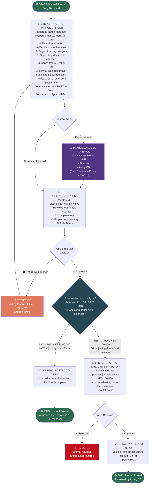

# WORKFLOW 6 — JOURNAL ENTRY APPROVAL
## Source: Workflow Plan Extract — Section 5.6 / Table 10

---

## JOURNAL ENTRY RULES (Finance Policy Section 7.2)

| Rule | Requirement |
|------|-------------|
| Accuracy | All entries accurate, complete, and timely |
| Supporting docs | Mandatory attachment for every journal |
| Donor coding | Correct tracking category required |
| Payroll journals | Restricted access — HR, Finance, Acting ED only |
| Post-approval lock | Journal locked from editing once approved |
| Retention | 10-year audit trail (Finance Policy Section 7.4) |
