# WORKFLOW 7 — BUDGET ADJUSTMENT APPROVAL
## Source: Workflow Plan Extract — Section 5.7 / Table 11

```mermaid
flowchart TD
    START([🟢 START: Budget Adjustment Needed]) --> INITIATE

    INITIATE["📝 STEP 1 — PROGRAMS MANAGER or ACTING FINANCE OFFICER\nGeoffrey Khira (Programs Mgr) / Janerose Nduta Motende (Acting Finance Officer)\nSubmits budget adjustment request specifying:\n① Budget lines affected\n② Amounts\n③ Justification\n④ Donor consent reference (where applicable)\nSystem flags if donor notification is required"]

    INITIATE --> FM_REV["💼 STEP 2 — ACTING FINANCE MANAGER\nPaul Celvins Ochieng'\n① Reviews financial impact\n② Confirms donor budget flexibility\n③ Assesses whether adjustment creates material variance\n   requiring Board communication\n④ Prepares summary of impact on all affected budget lines\nSLA: 24 hours"]

    FM_REV --> D1{"Finance Manager\nDecision"}
    D1 -->|"❌ Return"| REJ1["🟡 RETURNED\nInitiator corrects and resubmits"]
    REJ1 --> INITIATE
    D1 -->|"✅ Reviewed"| ODC_CHK

    ODC_CHK{"💰 MATERIALITY THRESHOLD\nDoes the adjustment exceed\n10% of the original budget line?"}

    ODC_CHK -->|"YES — exceeds 10%"| ODC_FLAG["⚠️ Board ODC Notification triggered\nActing Finance Manager flags\nadjustment to Acting ED\nfor Board ODC communication"]
    ODC_FLAG --> AED_APPR

    ODC_CHK -->|"NO — within 10%"| AED_APPR

    AED_APPR["🔑 STEP 3 — ACTING EXECUTIVE DIRECTOR\nRebecca Mbaya\nApproves ALL budget adjustments\nAnnual budget submitted to Board by 31 December\nSLA: 48 hours"]

    AED_APPR --> D2{"AED Decision"}
    D2 -->|"❌ Rejected"| REJ2["🔴 REJECTED\nExplanation required\nBudget lines unchanged"]
    D2 -->|"✅ Approved"| DONOR_CHK

    DONOR_CHK{"Is this a\ndonor-restricted grant\nadjustment?"}

    DONOR_CHK -->|"NO — internal budget"| XERO_UPDATE["🤖 SYSTEM ACTION\nActing Finance Manager approval in ApprovalMax\nXero tracking budget updated\nBoard ODC notification sent if material variance\nAudit trail complete"]
    XERO_UPDATE --> END_OK1(["🟢 END: Budget Adjusted\nXero tracking category updated"])

    DONOR_CHK -->|"YES — donor-restricted"| DONOR_APPR["📋 STEP 4 — DONOR APPROVAL\nActing ED + Programs Manager (Geoffrey Khira)\nObtain written donor approval BEFORE implementing adjustment\nDonor approval document attached in ApprovalMax\nCannot proceed without donor written consent"]

    DONOR_APPR --> D3{"Donor approval\nreceived?"}
    D3 -->|"❌ Donor declines"| REJ3["🔴 ADJUSTMENT BLOCKED\nCannot proceed without donor consent\nAED and Programs Mgr notified"]
    D3 -->|"✅ Donor approves\n(written consent attached)"| DONOR_XERO["🤖 SYSTEM ACTION\nActing Finance Officer adjusts Xero\ndonor tracking category budget\nDonor approval document on file in ApprovalMax"]
    DONOR_XERO --> END_OK2(["🟢 END: Donor Budget Adjusted\nXero tracking category updated\nDonor consent on file"])

    style START fill:#2d6a4f,color:#fff
    style END_OK1 fill:#2d6a4f,color:#fff
    style END_OK2 fill:#2d6a4f,color:#fff
    style REJ1 fill:#e07a5f,color:#fff
    style REJ2 fill:#c1121f,color:#fff
    style REJ3 fill:#c1121f,color:#fff
    style ODC_FLAG fill:#f4a261,color:#000
    style DONOR_CHK fill:#264653,color:#fff
    style ODC_CHK fill:#264653,color:#fff
```

---

## BUDGET ADJUSTMENT RULES (Finance Policy Section 3.3)

| Rule | Requirement |
|------|-------------|
| All adjustments | Require Acting ED approval |
| Material variances (>10% of budget line) | Board ODC communication triggered |
| Donor-restricted grants | Written donor consent BEFORE implementation |
| Annual budget | Submitted to Board by 31 December |
| Documentation | All adjustments documented in ApprovalMax |
