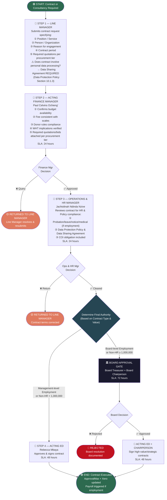

# WORKFLOW 8 — CONTRACT & CONSULTANCY APPROVAL
## Source: Workflow Plan Extract — Section 5.8 / Table 12

```mermaid
flowchart TD
    START([🟢 START: Contract or Consultancy Required]) --> LINE_MGR

    LINE_MGR["📝 STEP 1 — LINE MANAGER\nSubmits contract request specifying:\n① Position / Service\n② Person / Organization\n③ Reason for engagement\n④ Contract period\n⑤ Required quotations per procurement tier\n⚠️ Does contract involve personal data processing?\n   → Data Sharing Agreement REQUIRED\n   (Data Protection Policy Section 10.1.3)"]

    LINE_MGR --> FM_REV["💼 STEP 2 — ACTING FINANCE MANAGER\nPaul Celvins Ochieng'\n① Confirms budget availability\n② Fee consistent with scales\n③ Donor rules compliance\n④ WHT implications verified\n⑤ Required quotations/bids attached per procurement tier\nSLA: 24 hours"]

    FM_REV --> D1e{"Finance Mgr\nDecision"}
    D1e -->|"❌ Query"| REJ1(["🟡 RETURNED TO LINE MANAGER\nLine Manager resolves & resubmits"])
    D1e -->|"✅ Approved"| OHR_REV

    OHR_REV["🏢 STEP 3 — OPERATIONS & HR MANAGER\nJachtolinah Ndinda Nzive\nReviews contract for HR & Policy compliance:\n① Probation/leave/notice/medical (if employment)\n② Data Protection Policy & Data Sharing Agreement\n③ COI obligation included\nSLA: 24 hours"]

    OHR_REV --> D2e{"Ops & HR Mgr\nDecision"}
    D2e -->|"❌ Return"| REJ2(["🟡 RETURNED TO LINE MANAGER\nContract terms corrected"])
    D2e -->|"✅ Cleared"| FINAL_GATE{"Determine Final Authority\n(Based on Contract Type & Value)"}

    FINAL_GATE -->|"Management-level Employment\nor Non-HR < 1,000,000"| AED_SIGN["🔑 STEP 4 — ACTING ED\nRebecca Mbaya\nApproves & signs contract\nSLA: 48 hours"]
    AED_SIGN --> END_OK(["🟢 END: Contract Executed\nApprovalMax + Xero updated\nPayroll triggered if employment"])

    FINAL_GATE -->|"Board-level Employment\nor Non-HR ≥ 1,000,000"| BOARD_APPR["🏛️ BOARD APPROVAL GATE\nBoard Treasurer + Board Chairperson\nSLA: 72 hours"]
    BOARD_APPR --> D3{"Board Decision"}
    D3 -->|"❌ Rejected"| REJ3(["🔴 REJECTED\nBoard resolution documented"])
    D3 -->|"✅ Approved"| AED_SIGN_HIGH["🔑 ACTING ED + CHAIRPERSON\nSign high-value/strategic contracts\nSLA: 48 hours"]
    AED_SIGN_HIGH --> END_OK

    style START fill:#2d6a4f,color:#fff
    style END_OK fill:#2d6a4f,color:#fff
    style REJ1 fill:#e07a5f,color:#fff
    style REJ2 fill:#e07a5f,color:#fff
    style REJ3 fill:#c1121f,color:#fff
    style BOARD_APPR fill:#1a1a2e,color:#fff
    style FINAL_GATE fill:#264653,color:#fff
```
