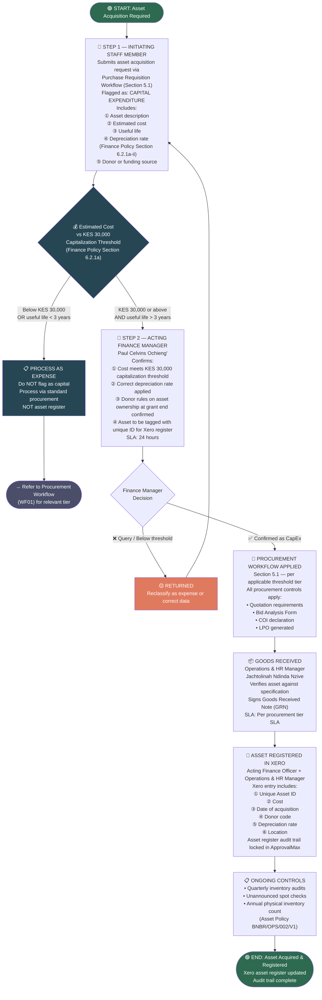

# WORKFLOW 9 — ASSET ACQUISITION
## Source: Workflow Plan Extract — Section 5.9a / Table 13

---

## ASSET CAPITALIZATION RULE

| Condition | Treatment |
|-----------|-----------|
| Cost ≥ KES 30,000 AND useful life > 3 years | Capitalized — add to Xero asset register |
| Cost < KES 30,000 OR useful life < 3 years | Expensed — do NOT add to asset register |

> **Source:** Finance Policy Section 6.2.1a
> **Quarterly audits** with unannounced spot checks required (Asset Policy BNBR/OPS/002/V1)
