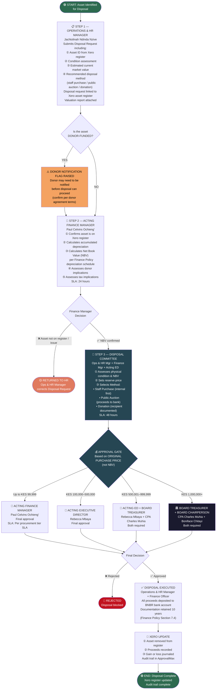

# WORKFLOW 10 — ASSET DISPOSAL
## Source: Workflow Plan Extract — Section 5.9b / Table 14

```mermaid
flowchart TD
    START([🟢 START: Asset Identified for Disposal]) --> OHR_SUBMIT

    OHR_SUBMIT["📋 STEP 1 — OPERATIONS & HR MANAGER\nJachtolinah Ndinda Nzive\nSubmits Disposal Request including:\n① Asset ID from Xero register\n② Condition assessment\n③ Estimated current market value\n④ Recommended disposal method\n   (staff purchase / public auction / donation)\nDisposal request linked to Xero asset register\nValuation report attached"]

    OHR_SUBMIT --> DONOR_FLAG{"Is the asset\nDONOR-FUNDED?"}
    DONOR_FLAG -->|"YES"| DONOR_NOTIF["⚠️ DONOR NOTIFICATION FLAG RAISED\nDonor may need to be notified\nbefore disposal can proceed\n(confirm per donor agreement terms)"]
    DONOR_NOTIF --> FM_REVIEW
    DONOR_FLAG -->|"NO"| FM_REVIEW

    FM_REVIEW["💼 STEP 2 — ACTING FINANCE MANAGER\nPaul Celvins Ochieng'\n① Confirms asset is on Xero register\n② Calculates accumulated depreciation\n③ Calculates Net Book Value (NBV)\n   per Finance Policy depreciation schedule\n④ Assesses donor implications\n⑤ Assesses tax implications\nSLA: 24 hours"]

    FM_REVIEW --> D1{"Finance Manager\nDecision"}
    D1 -->|"❌ Asset not on register / issue"| REJ1(["🟡 RETURNED TO HR\nOps & HR Manager corrects Disposal Request"])
    D1 -->|"✅ NBV confirmed"| COMMITTEE

    COMMITTEE["👥 STEP 3 — DISPOSAL COMMITTEE\nOps & HR Mgr + Finance Mgr + Acting ED\n① Assesses physical condition & NBV\n② Sets reserve price\n③ Selects Method:\n   • Staff Purchase (internal first)\n   • Public Auction (proceeds to bank)\n   • Donation (recipient documented)\nSLA: 48 hours"]

    COMMITTEE --> VALUE_GATE

    VALUE_GATE{"💰 APPROVAL GATE\nBased on ORIGINAL PURCHASE PRICE\n(not NBV)"}

    VALUE_GATE -->|"Up to KES 99,999"| FM_APPR["💼 ACTING FINANCE MANAGER\nPaul Celvins Ochieng'\nFinal approval\nSLA: Per procurement tier SLA"]
    VALUE_GATE -->|"KES 100,000–500,000"| AED_APPR["🔑 ACTING EXECUTIVE DIRECTOR\nRebecca Mbaya\nFinal approval"]
    VALUE_GATE -->|"KES 500,001–999,999"| AED_BT["🔑 ACTING ED + BOARD TREASURER\nRebecca Mbaya + CPA Charles Muhia\nBoth required"]
    VALUE_GATE -->|"KES 1,000,000+"| BOARD_ALL["🏛️ BOARD TREASURER + BOARD CHAIRPERSON\nCPA Charles Muhia + Boniface Chitayi\nBoth required"]

    FM_APPR --> FINAL_DEC{"Final Decision"}
    AED_APPR --> FINAL_DEC
    AED_BT --> FINAL_DEC
    BOARD_ALL --> FINAL_DEC

    FINAL_DEC -->|"❌ Rejected"| REJ2(["🔴 REJECTED\nDisposal blocked"])
    FINAL_DEC -->|"✅ Approved"| EXECUTE

    EXECUTE["✅ DISPOSAL EXECUTED\nOperations & HR Manager + Finance Officer\nAll proceeds deposited to BNBR bank account\nDocumentation retained 10 years\n(Finance Policy Section 7.4)"]

    EXECUTE --> XERO_UPDATE["🤖 XERO UPDATE\n① Asset removed from register\n② Proceeds recorded\n③ Gain or loss journaled\nAudit trail in ApprovalMax"]

    XERO_UPDATE --> END_OK(["🟢 END: Disposal Complete\nXero register updated\nAudit trail complete"])

    style START fill:#2d6a4f,color:#fff
    style END_OK fill:#2d6a4f,color:#fff
    style REJ1 fill:#e07a5f,color:#fff
    style REJ2 fill:#c1121f,color:#fff
    style DONOR_NOTIF fill:#f4a261,color:#000
    style COMMITTEE fill:#264653,color:#fff
    style VALUE_GATE fill:#264653,color:#fff
    style BOARD_ALL fill:#1a1a2e,color:#fff
```
