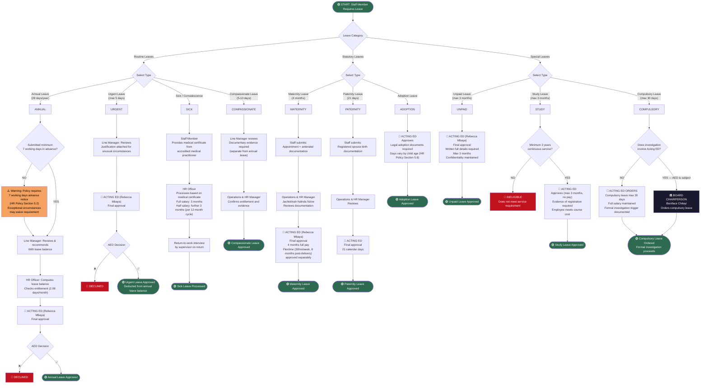

# WORKFLOW 11 — LEAVE APPLICATION
## Source: Workflow Plan Extract — Section 5.10a / Table 15

---

## LEAVE ENTITLEMENT SUMMARY (HR Policy)

| Leave Type | Entitlement | Final Approver |
|-----------|------------|----------------|
| Annual | 28 days/year (2.08 days/month) | Acting ED |
| Urgent | Max 5 days (deducted from annual) | Acting ED |
| Sick/Convalescence | 3 months full pay + 3 months half pay (per 12-month cycle) | HR Officer (medical cert) |
| Compassionate | 10 days (bereavement) / 5 days (exceptional) | Ops & HR Manager |
| Maternity | 4 months full pay | Acting ED |
| Paternity | 21 calendar days | Acting ED |
| Unpaid | Max 3 months | Acting ED |
| Study | Max 3 months (min 3 years service) | Acting ED |
| Adoption | Varies by child age | Acting ED |
| Compulsory | Max 30 days (full salary) | Acting ED (Board Chair if AED is subject) |
