# WORKFLOW 12 — ACTING APPOINTMENT
## Source: Workflow Plan Extract — Section 5.10b / Table 16

```mermaid
flowchart TD
    START([🟢 START: Acting Appointment Required]) --> LINE_MGR

    LINE_MGR["📝 STEP 1 — LINE MANAGER\nSubmits acting appointment request specifying:\n① Position\n② Proposed person\n③ Reason for appointment\n④ Proposed acting period"]

    LINE_MGR --> OHR_REV["🏢 STEP 2 — OPERATIONS & HR MANAGER\nJachtolinah Ndinda Nzive\nReviews:\n① Candidate qualifications\n② Acting appointment does not exceed 6 months\nApprovalMax flags AUTOMATICALLY at 5-month mark\nSLA: 24 hours"]

    OHR_REV --> D1{"Ops & HR Mgr\nDecision"}
    D1 -->|"❌ Ineligible candidate\nor other HR issue"| REJ1["🟡 RETURNED\nLine Manager identifies alternative"]
    REJ1 --> LINE_MGR
    D1 -->|"✅ HR clearance given"| DURATION_GATE

    DURATION_GATE{"Acting Period Duration?"}

    DURATION_GATE -->|"6 months or less"| AED_APPR["🔑 STEP 3 — ACTING EXECUTIVE DIRECTOR\nRebecca Mbaya\nApproves acting appointment IN WRITING\nActing allowance: difference between current\nconsolidated salary and starting salary\nof the higher position\n(HR Policy Section 3.4)\nSLA: 48 hours"]

    DURATION_GATE -->|"More than 6 months\n(or approaching 6 months)"| BOARD_DEC["🏛️ BOARD OF DIRECTORS\nBoard decides on extended acting appointment\nCannot exceed 6 months without Board decision\nSLA: Per Board meeting schedule"]

    AED_APPR --> D2{"AED Decision"}
    D2 -->|"❌ Declined"| REJ2["🔴 DECLINED\nActing appointment not effected"]
    D2 -->|"✅ Approved in writing"| MONTH_CHK

    BOARD_DEC --> D3{"Board Decision"}
    D3 -->|"❌ Declined"| REJ3["🔴 DECLINED\nBoard resolution documented"]
    D3 -->|"✅ Approved"| MONTH_CHK

    MONTH_CHK{"Acting allowance due?\n(Appointment exceeds\n1 continuous month?)"}

    MONTH_CHK -->|"NO — first month"| END_NO_ALLOW(["🟢 Acting Appointment Effected\nNo allowance yet\nApprovalMax monitors duration\n5-month auto-flag set"])

    MONTH_CHK -->|"YES — month 2 onwards"| PAYROLL_UPDATE["💼 STEP 4 — ACTING FINANCE OFFICER + ACTING FINANCE MANAGER\nJanerose Nduta Motende / Paul Ochieng'\nUpdates payroll to reflect acting allowance\nActing allowance triggered from the month\nthe appointment exceeds 1 continuous month\nPayroll Approval Workflow (Section 5.5) triggered\nSLA: 24 hours after approval"]

    PAYROLL_UPDATE --> FIVE_MONTH["⏰ ApprovalMax MONITORING\nAuto-flag at 5-month mark\nOps & HR Manager notified:\n'Acting appointment approaching 6-month limit'\nLine Manager must:\n① Extend via Board decision, or\n② End appointment, or\n③ Commence substantive appointment process"]

    FIVE_MONTH --> END_OK(["🟢 Acting Appointment Active\nPayroll updated\nApprovalMax monitoring active\nImmutable audit trail maintained"])

    style START fill:#2d6a4f,color:#fff
    style END_OK fill:#2d6a4f,color:#fff
    style END_NO_ALLOW fill:#2d6a4f,color:#fff
    style REJ1 fill:#e07a5f,color:#fff
    style REJ2 fill:#c1121f,color:#fff
    style REJ3 fill:#c1121f,color:#fff
    style BOARD_DEC fill:#1a1a2e,color:#fff
    style FIVE_MONTH fill:#f4a261,color:#000
```

---

## ACTING APPOINTMENTS — CURRENT INCUMBENTS

| Acting Role | Incumbent | Source |
|-------------|-----------|--------|
| Acting Executive Director | Rebecca Mbaya | Workflow Plan Extract Table 0 + HR Policy Section 3.4 |
| Acting Finance Manager | Paul Celvins Ochieng' | Workflow Plan Extract Table 0 + HR Policy Section 3.4 |

> ⚠️ **Note:** The workflow explicitly states (Section 5.10b): *"This workflow applies to Rebecca Mbaya (Acting ED) and Paul Ochieng' (Acting Finance Manager)."* Their acting appointment documentation should be confirmed as present in ApprovalMax before go-live.
