# WORKFLOW 13 — STAFF EXIT
## Source: Workflow Plan Extract — Section 5.10c / Table 17

```mermaid
flowchart TD
    START([🟢 START: Staff Member Initiates Exit\nor Exit Event Triggered]) --> EXIT_TYPE{"Exit Type?"}

    EXIT_TYPE -->|"Resignation"| RESIGN
    EXIT_TYPE -->|"Dismissal / Termination"| DISMISS
    EXIT_TYPE -->|"End of Contract"| EOC

    RESIGN["📝 STEP 1 — STAFF MEMBER\nSubmits written resignation to HR\nStates notice period per employment contract:\n• Acting ED and Senior Managers: 2 months\n• Junior staff: 1 month\n(HR Policy Section 16.2a)"]

    DISMISS["📝 STEP 1 — HR OFFICER\nDismissal documented per HR Policy\nNotice period or payment in lieu confirmed"]

    EOC["📝 STEP 1 — HR OFFICER\nEnd of contract confirmed\nFinal date recorded"]

    RESIGN --> NOTIFY
    DISMISS --> NOTIFY
    EOC --> NOTIFY

    NOTIFY["🏢 HR OFFICER — NOTIFIES:\n① Acting ED (Rebecca Mbaya)\n② Head of Department\n③ Finance Department\nDeadline: Day of receipt"]

    NOTIFY --> HANDOVER["🏢 STEP 2 — OPERATIONS & HR MANAGER / HEAD OF DEPARTMENT\nJachtolinah Ndinda Nzive / Relevant Dept Head\nConducts handover process:\n① All organisation property catalogued\n② All property signed back per HR Policy Section 16.7a\nDeadline: Within notice period"]

    HANDOVER --> EXIT_INT["🏢 EXIT INTERVIEW\nConducted by:\n• Operations & HR Manager (management staff)\n• Immediate Supervisor (all other staff)\nFor all NON-DISMISSAL exits\nResults documented in Staff Exit Interviews file\n(HR Policy Section 16.7c)\nDeadline: During notice period"]

    EXIT_INT --> FINAL_DUES["💼 STEP 4 — ACTING FINANCE OFFICER + ACTING FINANCE MANAGER\nJanerose Nduta Motende / Paul Celvins Ochieng'\nComputes final dues:\n① Salary to last day worked\n② Pro-rated leave\n③ Pro-rated allowances\n④ Separation dues per TCE Section 14\nAll statutory deductions remitted per current legislation\nAll exit data = Employee & HR Data\n(Data Protection Policy Section 6.6)\nDeadline: By last working day"]

    FINAL_DUES --> PROPERTY_CHK{"ALL BNBR property\nreturned and accounted for?"}

    PROPERTY_CHK -->|"NO — property outstanding"| HOLD_CERT["🔴 CLEARANCE CERTIFICATE WITHHELD\nFinal dues WITHHELD\nuntil all property accounted for\n(HR Policy Section 16.7d)"]
    HOLD_CERT --> PROPERTY_CHK

    PROPERTY_CHK -->|"YES — all property returned"| CLEARANCE["🔑 STEP 5 — ACTING ED + FINANCE OFFICER\nRebecca Mbaya + Janerose Nduta Motende\n① Employee signs Clearance Certificate\n② Certificate of Service issued by Acting ED\n   or authorised designate\n   (HR Policy Section 16.6)\nDeadline: By last working day"]

    CLEARANCE --> DATA_REVOKE["🤖 SYSTEM ACTION\nAll system access REVOKED:\n• ApprovalMax user deactivated\n• Xero access removed\n• All system permissions terminated\nAccesss revocation logged in ApprovalMax\nConfirm with IT Administrator"]

    DATA_REVOKE --> RECORDS["📋 RECORDS RETENTION\nAll exit documentation retained:\n• 10 years (Finance Policy Section 7.4)\nConfidentiality maintained per\nData Protection Policy"]

    RECORDS --> END_OK(["🟢 END: Staff Exit Complete\nClearance certificate issued\nFinal dues paid\nSystem access revoked\nAudit trail complete"])

    style START fill:#2d6a4f,color:#fff
    style END_OK fill:#2d6a4f,color:#fff
    style HOLD_CERT fill:#c1121f,color:#fff
    style DATA_REVOKE fill:#264653,color:#fff
    style NOTIFY fill:#533483,color:#fff
```

---

## STAFF EXIT NOTICE PERIODS (HR Policy)

| Category | Notice Period |
|----------|--------------|
| Acting ED and Senior Managers | 2 months |
| Junior Staff | 1 month |

> **Certificate of Service:** Issued by Acting ED or authorised designate (HR Policy Section 16.6)
> **Final dues:** Settled only after all property is accounted for and clearance certificate signed (HR Policy Section 16.7)
> **System access:** Must be revoked on last working day — confirm process with IT Administrator.
