# WORKFLOW 14 — DATA ACCESS & SYSTEM PERMISSION APPROVAL
## Source: Workflow Plan Extract — Section 5.11 / Table 18 + Table 19

```mermaid
flowchart TD
    START([🟢 START: Data Access Required]) --> REQUEST

    REQUEST["📝 STEP 1 — STAFF MEMBER or IT ADMINISTRATOR\nSubmit Data Access Request in ApprovalMax specifying:\n① System: Xero / ApprovalMax / MERL database / Payroll\n② Data category\n③ Business justification\n④ Duration of access required\nSystem auto-tags with data classification\n(Data Protection Policy Section 6)"]

    REQUEST --> MFA_CHK{"MFA enabled\nfor requesting user?"}
    MFA_CHK -->|"NO — MFA not active"| MFA_BLOCK["🔴 BLOCKED\nMFA must be activated BEFORE\naccess can be granted\n(Data Protection Policy Section 9.3c)\nNo exceptions"]
    MFA_BLOCK --> MFA_CHK
    MFA_CHK -->|"YES — MFA active"| DATA_CLASS

    DATA_CLASS{"Data Classification?\nWhat data is being\naccessed?"}

    DATA_CLASS -->|"Standard operational data\n(not Special Category)"| LINE_REV

    DATA_CLASS -->|"SPECIAL CATEGORY DATA:\n• Payroll data\n• Board-level documents\n• Beneficiary health records\n• Beneficiary mental health records\n• Any personal data beyond standard role"| SPECIAL_ROUTE["⚠️ SPECIAL CATEGORY DATA\nFlagged for MANDATORY\nActing ED sign-off"]

    LINE_REV["📋 STEP 2 — LINE MANAGER / DEPARTMENT HEAD\n① Reviews and confirms business need\n② Confirms proportionality\n③ Aligns with need-to-know principle\n④ Aligns with least-privilege principle\n   (Data Protection Policy Section 9.3a)\nJustification note added — part of Kenya DPA 2019 compliance record\nSLA: 24 hours"]

    LINE_REV --> D1{"Line Manager\nDecision"}
    D1 -->|"❌ Business need\nnot confirmed"| REJ1["🔴 DECLINED\nRequest closed\nReason documented"]
    D1 -->|"✅ Business need confirmed"| SCOPE_REV

    SCOPE_REV["🏢 STEP 3 — OPERATIONS & HR MANAGER\nJachtolinah Ndinda Nzive\nor\nMERL LEAD (for MERL and beneficiary data)\nJefferson Ponde Ochilo\n① Reviews access scope vs role responsibilities\n② Confirms data minimization principle upheld\n③ Flags any Special Category data\n   for mandatory Acting ED sign-off\nSLA: 24 hours"]

    SCOPE_REV --> D2{"Scope Review\nDecision"}
    D2 -->|"❌ Access scope too broad"| REJ2["🟡 RETURNED\nAccess scope revised\nResubmitted"]
    REJ2 --> REQUEST
    D2 -->|"✅ Scope appropriate — standard data"| STANDARD_GRANT
    D2 -->|"⚠️ Special Category data flagged"| SPECIAL_ROUTE

    SPECIAL_ROUTE --> AED_REV["🔑 STEP 4 — ACTING EXECUTIVE DIRECTOR\nRebecca Mbaya\nMANDATORY APPROVAL for:\n• Payroll data\n• Board-level documents\n• Beneficiary health and mental health data\n• Any access giving sight of personal data\n  beyond standard role\nAll approvals logged — part of RBAC compliance record\n(Data Protection Policy Section 9.3)\nSLA: 48 hours"]

    AED_REV --> D3{"AED Decision"}
    D3 -->|"❌ Declined"| REJ3["🔴 DECLINED\nReason documented\nCompliance record updated"]
    D3 -->|"✅ Approved"| STANDARD_GRANT

    STANDARD_GRANT["🔑 STEP 5 — IT ADMINISTRATOR\nActivates access in system\nMFA verified as ACTIVE before access granted\nAccess expiry date SET in ApprovalMax\n90-day review reminder auto-generated\nAccess grant logged in RBAC compliance record"]

    STANDARD_GRANT --> ACCESS_LIVE(["🟢 ACCESS ACTIVE\nAudit trail in ApprovalMax"])

    ACCESS_LIVE --> REVIEW_90["⏰ 90-DAY ACCESS REVIEW\n(Auto-generated by ApprovalMax)\nOperations & HR Manager reviews:\n① Is access still required?\n② Is access still proportionate?\nExpired or unnecessary access REVOKED immediately\n(Data Protection Policy Section 9.3b)"]

    REVIEW_90 --> STILL_NEEDED{"Access still\nrequired and\nproportionate?"}
    STILL_NEEDED -->|"YES"| REVIEW_90
    STILL_NEEDED -->|"NO"| REVOKE["🔴 ACCESS REVOKED\nRevocation logged in ApprovalMax\nImmutably"]

    REVOKE --> END_REVOKE(["🟢 END: Access Revoked\nAudit trail complete"])

    ACCESS_LIVE --> BREACH_MON["🔍 BREACH MONITORING\nAny unauthorized data access\n= potential data breach\nActing Finance Officer (Janerose Nduta Motende)\nis designated FIRST POINT OF CONTACT\nfor ApprovalMax and Xero breach reporting"]

    BREACH_MON --> BREACH_DET{"Unauthorized\naccess detected?"}
    BREACH_DET -->|"NO"| ACCESS_LIVE
    BREACH_DET -->|"YES"| BREACH_RESP["🚨 BREACH RESPONSE\nBreath notification workflow triggered\nReport to ODPC within 72 HOURS\n(Data Protection Policy Section 11.2a)\nActing Finance Officer notifies ODPC\nActing ED and Operations & HR Manager\nalerted immediately"]
    BREACH_RESP --> END_BREACH(["🔴 END: Breach Reported\nODPC notified within 72 hours\nAudit trail preserved"])

    style START fill:#2d6a4f,color:#fff
    style ACCESS_LIVE fill:#2d6a4f,color:#fff
    style END_REVOKE fill:#2d6a4f,color:#fff
    style MFA_BLOCK fill:#c1121f,color:#fff
    style REJ1 fill:#c1121f,color:#fff
    style REJ2 fill:#e07a5f,color:#fff
    style REJ3 fill:#c1121f,color:#fff
    style REVOKE fill:#c1121f,color:#fff
    style BREACH_RESP fill:#c1121f,color:#fff
    style END_BREACH fill:#c1121f,color:#fff
    style SPECIAL_ROUTE fill:#533483,color:#fff
    style DATA_CLASS fill:#264653,color:#fff
    style REVIEW_90 fill:#264653,color:#fff
```

---

## DATA PROTECTION COMPLIANCE CONTROLS (Data Protection Policy)

| Control | Rule |
|---------|------|
| MFA Mandatory | All ApprovalMax and Xero users — MFA active before go-live. No exceptions. (Section 9.3c) |
| Least Privilege | Each user accesses only data necessary for their specific role (Section 9.3a) |
| 90-Day Reviews | All access grants reviewed every 90 days; outdated access revoked promptly (Section 9.3b) |
| 72-Hour Breach Notification | Data breach reported to ODPC within 72 hours. First contact: Janerose Nduta Motende (Section 11.2a) |
| DPIA Required | Data Protection Impact Assessment before ApprovalMax go-live (Section 12) |
| Data Sharing Agreements | Required for any vendor/partner processing BNBR or beneficiary personal data (Section 10.1.3) |
| Non-Retaliation | No staff penalized for raising data protection concerns (Sections 15 and 1.18) |
