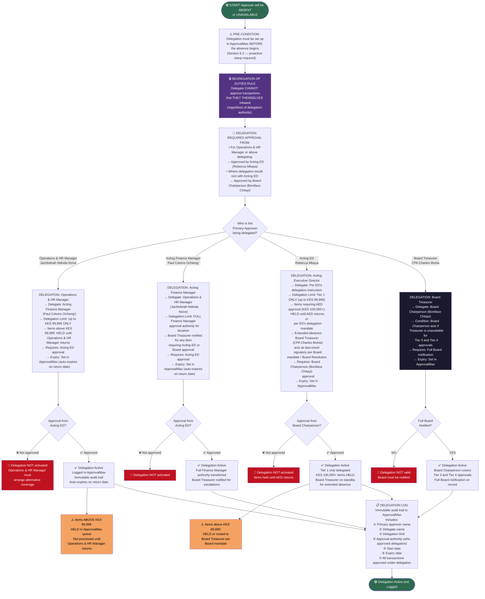

# DELEGATION AUTHORITY ARCHITECTURE
## Source: Workflow Plan Extract — Section 6.2 / Table 21

---

## DELEGATION RULES SUMMARY (Section 6.2)

| Primary Approver | Standard Delegate | Delegation Limit | Authorized By |
|-----------------|-------------------|-----------------|---------------|
| Operations & HR Manager (Jachtolinah Nzive) | Acting Finance Manager (Paul Ochieng') | Tier 1 only — up to KES 99,999. Items above KES 99,999 HELD. | Acting ED (Rebecca Mbaya) |
| Acting Finance Manager (Paul Ochieng') | Operations & HR Manager (Jachtolinah Nzive) | Full Finance Manager authority for duration. Board Treasurer notified for ED/Board-level items. | Acting ED (Rebecca Mbaya) |
| Acting ED (Rebecca Mbaya) | Per ED's delegation instruction | Tier 1 only — up to KES 99,999. KES 100K+ held / Board Treasurer covers extended absences. | Board Chairperson (Boniface Chitayi) |
| Board Treasurer (CPA Charles Muhia) | Board Chairperson (Boniface Chitayi) | Tier 3 & 4 approvals | Full Board notification required |

> **Mandatory conditions for ALL delegations:**
> 1. Set up BEFORE absence begins
> 2. Time-limited with automatic expiry date in ApprovalMax
> 3. Delegate cannot approve transactions they themselves initiated
> 4. All delegations logged as immutable audit trail in ApprovalMax
> 5. Segregation: ordering, quality certification, storage, and payment authorization remain with different individuals (Procurement Policy Section 6)
