# ESCALATION WORKFLOW
## Source: Workflow Plan Extract — Section 6.1 / Table 20

```mermaid
flowchart TD
    START([🟢 Approval Request Submitted in ApprovalMax]) --> PENDING

    PENDING["⏳ APPROVAL PENDING\nApprover has been notified\nTimer starts from submission"]

    PENDING --> T24{"⏰ 24 HOURS ELAPSED?\nApproval still pending?"}

    T24 -->|"NO — Approved or Rejected\nwithin 24 hours"| RESOLVED(["✅ RESOLVED\nNo escalation required"])

    T24 -->|"YES — still pending at 24 hours"| ESC1

    ESC1["📧 ESCALATION LEVEL 1 — 24 HOURS\nSystem sends REMINDER notification to:\n• Pending approver — email\n• Pending approver — ApprovalMax mobile app\nAction required from: APPROVER THEMSELVES"]

    ESC1 --> T48{"⏰ 48 HOURS ELAPSED?\nApproval still pending?"}

    T48 -->|"NO — Resolved between 24–48 hours"| RESOLVED

    T48 -->|"YES — still pending at 48 hours"| ESC2

    ESC2["📧 ESCALATION LEVEL 2 — 48 HOURS\nSystem sends ESCALATION notification to:\n• Approver's LINE MANAGER\nLine Manager must:\n① Contact the approver directly\n② Determine if delegation is needed\n③ Ensure action is taken urgently"]

    ESC2 --> T72{"⏰ 72 HOURS ELAPSED?\nApproval still pending?"}

    T72 -->|"NO — Resolved between 48–72 hours"| RESOLVED

    T72 -->|"YES — still pending at 72 hours"| ESC3

    ESC3["🔑 ESCALATION LEVEL 3 — 72 HOURS\nSystem ESCALATES TO ACTING ED:\nRebecca Mbaya\nSystem sends SUMMARY of ALL pending approvals\nActing ED must:\n① Review all pending items\n② Take direct action or override\n③ Arrange emergency delegation if required"]

    ESC3 --> T96{"⏰ 96 HOURS ELAPSED?\nApproval still pending?"}

    T96 -->|"NO — Resolved between 72–96 hours"| RESOLVED

    T96 -->|"YES — still pending at 96 hours"| ESC4

    ESC4["🚨 ESCALATION LEVEL 4 — 96 HOURS\nCRITICAL DELAY\nSystem flags transaction as:\n'CRITICAL DELAY' in Finance Dashboard\n\nSYSTEM LOCKS further transactions by\nINITIATING DEPARTMENT until matter resolved\n\nActing ED and Finance Manager\nnotified with CRITICAL DELAY status\nBoard Treasurer notified if approval\ninvolves Tier 3 or Tier 4 items"]

    ESC4 --> LOCK_ACTION{"Department\ntransactions\nLOCKED"}

    LOCK_ACTION --> RESOLUTION["🔑 RESOLUTION REQUIRED\nActing ED (Rebecca Mbaya) must:\n① Approve the pending item, OR\n② Formally reject the pending item, OR\n③ Formally delegate to authorised delegate\n④ Document reason for delay\nAll actions logged immutably in ApprovalMax"]

    RESOLUTION --> UNLOCK["🤖 SYSTEM UNLOCK\nUpon Acting ED action:\nDepartment transactions UNLOCKED\nCritical Delay flag removed\nFull audit trail of delay and resolution"]

    UNLOCK --> END_OK(["🟢 RESOLVED\nDelay documented\nAudit trail complete"])

    style START fill:#2d6a4f,color:#fff
    style RESOLVED fill:#2d6a4f,color:#fff
    style END_OK fill:#2d6a4f,color:#fff
    style ESC1 fill:#f4a261,color:#000
    style ESC2 fill:#e07a5f,color:#fff
    style ESC3 fill:#c1121f,color:#fff
    style ESC4 fill:#6a0572,color:#fff
    style LOCK_ACTION fill:#6a0572,color:#fff
    style RESOLUTION fill:#1a1a2e,color:#fff
    style PENDING fill:#264653,color:#fff
```



---

## ESCALATION TIMELINE SUMMARY (Section 6.1 — Table 20)

```mermaid
gantt
    title ApprovalMax Escalation Timeline
    dateFormat HH
    axisFormat %H hrs

    section Normal
    Approval window          :active, a1, 00, 24h

    section Escalation Level 1
    Reminder to approver     :crit, e1, 24, 1h

    section Escalation Level 2
    Manager escalation       :crit, e2, 48, 1h

    section Escalation Level 3
    Acting ED escalation     :crit, e3, 72, 1h

    section Escalation Level 4
    CRITICAL DELAY + Lock    :crit, e4, 96, 1h
```

| Hours | Action | Who is Notified |
|-------|--------|----------------|
| 24 hrs | Reminder notification | Pending approver (email + mobile app) |
| 48 hrs | Escalation notification | Approver's line manager |
| 72 hrs | Summary of all pending approvals | Acting ED (Rebecca Mbaya) |
| 96 hrs | CRITICAL DELAY flag + Department transaction lock | Finance Dashboard + Acting ED |
